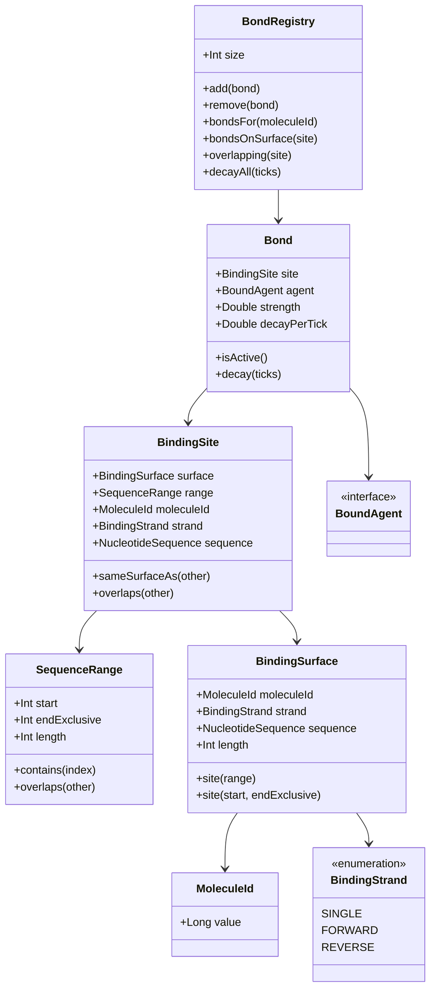
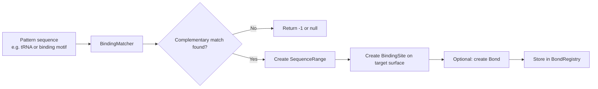
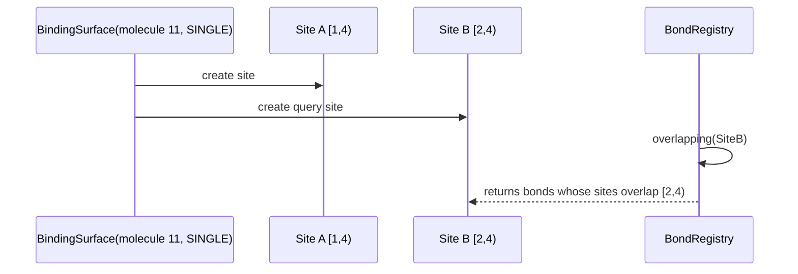

# Bonds

This document explains the current bond model in `life.sim.biology.interactions`.

The goal of the bond layer is to represent **runtime occupancy** on molecules such as DNA and RNA without putting mutable state directly into immutable value types like:

- `life.sim.biology.primitives.NucleotideSequence`
- `life.sim.biology.molecules.Dna`
- `life.sim.biology.molecules.MRna`
- `life.sim.biology.molecules.TRna`

In other words:

- molecule classes describe **what a molecule is**
- bond classes describe **what is currently bound to it**

---

## Why bonds are separate from molecules

A DNA or mRNA sequence should still be the same molecule value whether:

- nothing is bound to it
- a repressor is bound over a regulatory site
- a polymerase is bound near a start region
- several weak bonds are present and decaying over time

Because of that, bond state lives in the `interactions` package as runtime data.

---

## Core concepts

The current model is built from a few small pieces.

## 1. `SequenceRange`

`SequenceRange` lives in `life.sim.biology.primitives` and defines a half-open interval:

- `start` is inclusive
- `endExclusive` is exclusive

So a range like `SequenceRange(2, 5)` covers indexes `2`, `3`, and `4`.

This makes slicing and overlap checks easier and less error-prone.

### Example

- `SequenceRange(1, 4)` on `>AUGCUA>` refers to `UGC`
- `SequenceRange(4, 6)` refers to `UA`

---

## 2. `BindingSurface`

A `BindingSurface` is an addressable strand of a molecule.

It contains:

- `moleculeId`: a stable runtime identity for the molecule instance
- `strand`: which strand is being addressed
- `sequence`: the sequence exposed by that strand

Current strand options are:

- `BindingStrand.SINGLE`
- `BindingStrand.FORWARD`
- `BindingStrand.REVERSE`

This means DNA and RNA can share one site model.

---

## 3. `BindingSite`

A `BindingSite` combines:

- a `BindingSurface`
- a `SequenceRange`

This gives a concrete address like:

- molecule `11`
- forward strand
- indexes `[12, 20)` (that is, indexes `12` through `19`)

A `BindingSite` can also expose the exact subsequence at that site via `site.sequence`.

---

## 4. `Bond`

A `Bond` is the actual runtime record of something bound to a site.

It stores:

- `site`: where the bond exists
- `agent`: what is bound there
- `strength`: current bond strength
- `decayPerTick`: how much strength is lost per decay step

This is the current data shape behind bond state.

---

## 5. `BondRegistry`

`BondRegistry` is a mutable in-memory store of active bonds.

It currently supports:

- adding and removing bonds
- listing bonds for a molecule
- listing bonds on the same surface
- finding overlapping bonds
- decaying all bonds and removing inactive ones

Right now, this is intentionally simple: it is a runtime storage object, not yet a full simulation system.

---

## Molecule surfaces

The extension helpers in `MoleculeBindingSites.kt` expose molecule-specific binding surfaces.

## DNA

DNA has two separate addressable surfaces:

- `forwardBindingSurface(id)`
- `reverseBindingSurface(id)`

That lets you distinguish between strand-specific sites on the duplex.

## mRNA and tRNA

RNA molecules currently expose a single strand:

- `bindingSurface(id)`

This maps to `BindingStrand.SINGLE`.

---

## Structure overview



---

## How complementary matching works

`BindingMatcher` provides shared sequence-driven matching logic.

The main function is:

- `complementaryMatchStart(pattern, target)`

It scans the target and returns:

- the first start index where the pattern matches by complementarity
- `-1` if no complementary match exists

There is also:

- `complementaryMatchSite(pattern, surface)`

which returns a full `BindingSite` when a complementary match is found.

This logic is now shared with `TRna.scan(...)`, so tRNA scanning and general complementary binding use the same rules.

---

## Matching flow



---

## Example: finding a site on mRNA

Suppose we have:

- pattern: `AUG`
- target mRNA sequence: `CCUACUAC`

The complementary match is found at index `2`, because:

- pattern: `A U G`
- target site: `U A C`
- each position complements the pattern

So the resulting site is:

- `SequenceRange(2, 5)`
- strand: `SINGLE`
- sequence: `UAC`

---

## Example: creating a bond

A repressor-like agent could bind to a previously identified site.

Conceptually:

1. identify a molecule surface
2. identify or compute a binding site
3. create a bond with strength and decay
4. store it in a registry

```kotlin
val surface = mrna.bindingSurface(MoleculeId(11))
val site = surface.site(2, 5)
val bond = Bond(
    site = site,
    agent = repressor,
    strength = 0.8,
    decayPerTick = 0.1,
)
registry.add(bond)
```

The exact `repressor` type is not implemented yet, but it would implement `BoundAgent`.

---

## Overlap and occupancy

Two sites overlap only when all of the following are true:

1. they are on the same molecule
2. they are on the same strand/surface
3. their ranges overlap

That means:

- two sites on different molecules do **not** overlap
- forward and reverse DNA strand sites do **not** overlap
- adjacent half-open ranges like `[1, 4)` and `[4, 6)` do **not** overlap

This is important for repression, blocking, or collision logic later.

### Overlap example



---

## Bond decay

A bond weakens over time using:

- `strength`
- `decayPerTick`

Calling `bond.decay(ticks)` reduces strength linearly:

- new strength = `max(0.0, strength - decayPerTick * ticks)`

`BondRegistry.decayAll(ticks)` applies this to every stored bond and removes bonds that are no longer active.

This gives a simple first-pass lifecycle for temporary occupancy.

---

## What this model is good at

The current design is well suited for:

- repressors bound to DNA sites
- polymerases bound to strand-specific start regions
- temporary occupancy on mRNA
- overlap checks for blocked regions
- simple time-based decay of bonds

---

## Current limits

This is a deliberately minimal first pass.

Current limitations include:

- `BoundAgent` is only a marker interface
- `BondRegistry` is in-memory and local, not yet integrated into a wider simulation state model
- bonds currently connect an agent to one site, not one site to another site
- there is no conflict resolution or affinity scoring beyond stored strength/decay values
- there is no built-in concept of promoter, operator, gene, or repression policy yet

---

## Likely next steps

Reasonable follow-up additions would be:

- concrete `BoundAgent` implementations such as `Repressor` or `Polymerase`
- helper logic such as `isBlocked(site)` or `tryBind(agent, site)`
- gene/operator/promoter annotations that can be checked against active bonds
- richer affinity models that derive initial bond strength from sequence matching
- simulator or cell-state integration using `MoleculeId`

---

## Summary

The current bond system separates:

- **molecule structure** (`Dna`, `MRna`, `TRna`, `NucleotideSequence`)
- **runtime binding state** (`BindingSite`, `Bond`, `BondRegistry`)

That gives a clean foundation for later features like:

- gene repression
- polymerase occupancy
- blocking/competition between agents
- time-based bond decay

without turning core molecule types into mutable state containers.

