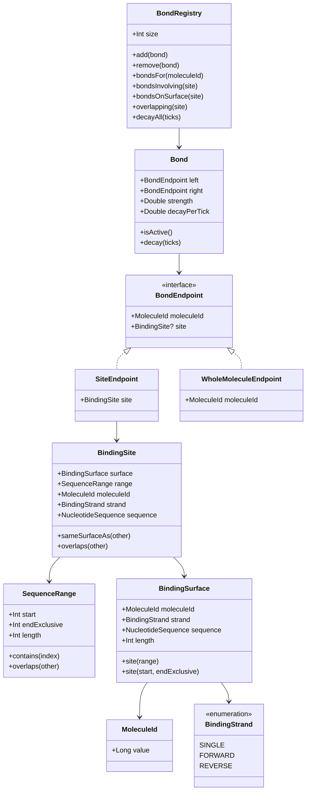
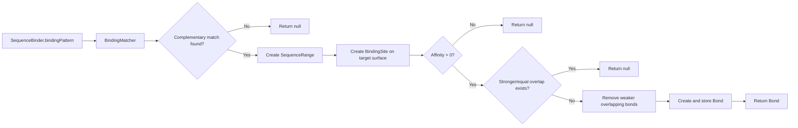

# Bonds

This document explains the current bond model in `life.sim.biology.interactions`.

The bond layer models **runtime associations between molecules** without putting mutable state directly into immutable molecule value types such as:

- `life.sim.biology.primitives.NucleotideSequence`
- `life.sim.biology.molecules.Dna`
- `life.sim.biology.molecules.MRna`
- `life.sim.biology.molecules.TRna`

In short:

- molecule classes describe **what molecules are**
- bond classes describe **which molecules are currently associated**

Associations can be site-specific, molecule-wide, or mixed.

---

## Why bonds are separate from molecules

A DNA or RNA molecule value should still be the same value whether:

- nothing is currently associated with it
- one site is occupied by another molecule
- several molecules are connected as a temporary complex
- some associations are coarse-grained (whole-molecule) and others are site-level

Because of that, bond state lives in `interactions` as runtime data.

---

## Core concepts

## 1. `SequenceRange`

`SequenceRange` lives in `life.sim.biology.primitives` and defines a half-open interval:

- `start` is inclusive
- `endExclusive` is exclusive

So a range like `SequenceRange(2, 5)` covers indexes `2`, `3`, and `4`.

---

## 2. `BindingSurface`

A `BindingSurface` is an addressable strand of a molecule.

It contains:

- `moleculeId`: stable runtime identity
- `strand`: strand selection (`SINGLE`, `FORWARD`, `REVERSE`)
- `sequence`: exposed sequence on that strand

---

## 3. `BindingSite`

A `BindingSite` combines:

- a `BindingSurface`
- a `SequenceRange`

This gives a concrete address like:

- molecule `11`
- forward strand
- indexes `[12, 20)`

---

## 4. `BondEndpoint`

A `BondEndpoint` names one side of a bond. Two endpoint variants are supported:

- `SiteEndpoint(site)` for site-aware associations
- `WholeMoleculeEndpoint(moleculeId)` for non-site-specific associations

This allows:

- site ↔ site
- site ↔ whole molecule
- whole molecule ↔ whole molecule

---

## 5. `Bond`

`Bond` is a runtime association between two molecule endpoints:

- `left: BondEndpoint`
- `right: BondEndpoint`
- `strength`
- `decayPerTick`

Bond identity is **undirected**: swapping `left` and `right` does not create a different bond.

It keeps lifecycle helpers:

- `isActive()`
- `decay(ticks)`

---

## 6. `BondRegistry`

`BondRegistry` stores active bonds and supports:

- add/remove
- query by participating molecule (`bondsFor`)
- query bonds touching an exact site (`bondsInvolving`)
- query bonds that have any endpoint on the same surface (`bondsOnSurface`)
- query overlap against a site (`overlapping`)
- decay all bonds and remove inactive entries (`decayAll`)

---

## Structure overview



---

## Matching flow

`BindingMatcher` still handles complementary sequence matching and site generation, including
`ProteinBinding.tryBind(...)` calls from interpreted `SequenceBinder` capabilities.



---

## `ProteinBinding.tryBind(...)` return model

`ProteinBinding.tryBind(...)` returns a nullable `Bond`.

The return contract is:

- returns a `Bond` when matching succeeds and occupancy checks pass
- returns `null` when there is no complementary site, the affinity normalizes to inactive (`<= 0`), or an equal/stronger overlapping bond occupies the region

Conflict resolution still happens inside `ProteinBinding` by mutating `BondRegistry`:

- weaker overlapping bonds are removed before creating a stronger replacement bond
- callers can validate side effects by inspecting registry state rather than consuming a displaced-bonds payload

---

## Example: creating different bond kinds

```kotlin
val dnaSurface = dna.forwardBindingSurface(MoleculeId(11))
val rnaSurface = mrna.bindingSurface(MoleculeId(12))

val siteToSite = Bond(
    left = SiteEndpoint(dnaSurface.site(3, 8)),
    right = SiteEndpoint(rnaSurface.site(0, 5)),
    strength = 0.8,
    decayPerTick = 0.05,
)

val siteToWhole = Bond(
    left = SiteEndpoint(dnaSurface.site(8, 12)),
    right = WholeMoleculeEndpoint(MoleculeId(99)),
    strength = 0.7,
    decayPerTick = 0.08,
)

val wholeToWhole = Bond(
    left = WholeMoleculeEndpoint(MoleculeId(99)),
    right = WholeMoleculeEndpoint(MoleculeId(100)),
    strength = 0.6,
    decayPerTick = 0.03,
)

registry.add(siteToSite)
registry.add(siteToWhole)
registry.add(wholeToWhole)
```

---

## Overlap semantics

Overlap is defined only for endpoints that have `BindingSite` detail.

That means:

- site ↔ site overlap works as usual
- site ↔ whole molecule does **not** produce overlap from the whole endpoint
- whole ↔ whole has no site range and is ignored by overlap queries
- surface queries (`bondsOnSurface`) ignore whole-molecule endpoints

This keeps DNA/RNA occupancy checks precise while allowing coarse associations elsewhere.

---

## Bond decay

Decay remains unchanged:

- new strength = `max(0.0, strength - decayPerTick * ticks)`
- inactive bonds are removed by `BondRegistry.decayAll(ticks)`

---

## What this model is good at

The current model supports both occupancy and connectivity:

- DNA/RNA site occupancy with overlap checks
- mixed-detail associations while models are still coarse
- temporary complex-internal links as molecule graphs
- time-based weakening/removal of associations

---

## Current limits

Current limitations include:

- no affinity-scoring or competitive binding policy yet
- registry is still in-memory and not yet integrated with broader simulation state
- complex membership derivation is not yet packaged as a dedicated helper API

---

## Likely next steps

Reasonable follow-up additions:

- helpers to derive connected molecule complexes from active bonds
- higher-level bind/release policies (competition, affinity, blockage)
- richer interaction semantics for transcription machinery built on top of this substrate
- optional docs for complex graph behavior (`docs/biology/interactions/complexes.md`)

---

## Summary

The bond system now separates:

- **molecule structure** (`Dna`, `MRna`, `TRna`, `NucleotideSequence`)
- **runtime association state** (`BondEndpoint`, `Bond`, `BondRegistry`)

By making bonds symmetric between two molecule participants with optional site detail on either side, the model supports both classical occupancy and emergent complex networks.
